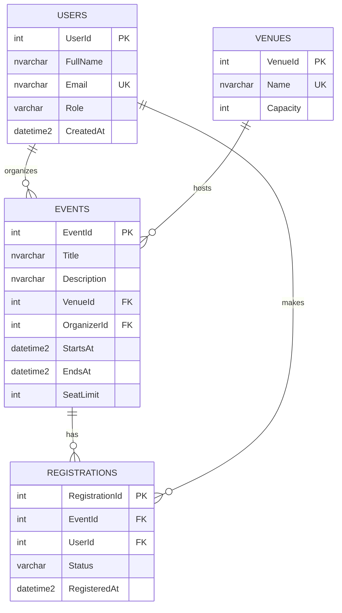

# Online Campus Event Management System: Submission

## Team Roster

| Member | Name | Assigned Role | Tasks |
|---|---|---|---|
| Member 1 | _[Full name]_ | Systems Architect & Prompt Lead | Task 1, Task 5 |
| Member 2 | _[Full name]_ | Frontend Engineer | Task 2 |
| Member 3 | _[Full name]_ | Database & Backend Engineer | Task 3 |
| Member 4 | _[Full name]_ | QA & Security Engineer | Task 4 |

_(Group of 3: Members 1 and 3 split Task 4.)_

## Setup Instructions

Requirements: .NET 8 SDK and VS Code (with the C# Dev Kit extension).

1. Clone the repository and open the `MidtermLabExam` folder in VS Code.
2. **Run the website (frontend + backend API):**
   ```bash
   cd CampusEvents
   dotnet run
   ```
   Open the `http://localhost:xxxx` address printed in the terminal. Do not open `index.html` by double-clicking, because the page needs the API to load events.
3. **Run the unit tests:**
   ```bash
   cd CampusEvents.Tests
   dotnet test
   ```
4. **Database:** open `database/schema.sql` in SSMS / Azure Data Studio (or the VS Code mssql extension), connect to an empty SQL Server database, and run it.
5. `CampusEvents/backend/RegistrationService.cs` needs a real connection string passed in; never commit credentials.

## Project Structure

```
MidtermLabExam/
├── SUBMISSION.md
├── database/schema.sql                       (Task 3)
├── CampusEvents/                             (ASP.NET Core minimal API + static frontend)
│   ├── Program.cs                            (API endpoints)
│   ├── Models/Models.cs
│   ├── backend/                              (Task 4 backend code)
│   │   ├── RegistrationService.cs
│   │   ├── RegistrationValidator.cs
│   │   └── InMemoryEventRepository.cs
│   └── wwwroot/                              (Task 2 frontend)
│       ├── index.html
│       ├── styles.css
│       └── app.js
└── CampusEvents.Tests/                       (Task 4 unit tests)
    └── RegistrationValidatorTests.cs
```

Note: the frontend lives in `CampusEvents/wwwroot/` (the folder ASP.NET serves as static files) and the backend in `CampusEvents/backend/`. These are the `/frontend` and `/backend` deliverables.

## Task 1: Requirements Analysis & Prompt Architecture

### Prompt (RCTC)

```text
ROLE: You are a Lead Systems Architect with 15 years of experience designing small web systems for universities.

CONTEXT: A team of 3-4 fourth-year IT students has exactly 3 hours to build a working prototype of an Online Campus Event Management System. Students must view upcoming events and register for one; administrators must view registered attendees. The team knows HTML/CSS/JavaScript, C#/.NET and SQL Server at a beginner-to-intermediate level and will use generative AI tools for help.

TASK: Produce an overall system design: (1) functional requirements, (2) a three-tier architecture with components and responsibilities, (3) main data entities, (4) a list of REST endpoints, (5) a work breakdown for 4 people that fits in 3 hours.

CONSTRAINTS:
- Do not use third-party state management libraries such as Redux.
- Do not propose microservices, message queues, Docker orchestration or cloud-specific services.
- Do not include features beyond the three stated requirements (no payments, no notifications).
- Keep the response under 600 words, use headings and bullet points.
- If an assumption is needed, state it explicitly instead of inventing requirements.
```

### AI Output

**1. Functional requirements**
- FR1: Students can list upcoming events (title, date, venue, seats left).
- FR2: Students can register with a `@univ.edu.ph` email; duplicate registrations and full events are rejected.
- FR3: Admins can view the attendee list per event.
- Assumption: authentication is out of scope; the admin view is a separate page.

**2. Architecture (3-tier monolith)**
- *Presentation:* static HTML/CSS/vanilla JS, with state held in plain JS objects.
- *Application:* ASP.NET Core Web API with a `RegistrationService` (business rules: email domain, seat limit, duplicates).
- *Data:* SQL Server with `Users`, `Venues`, `Events`, `Registrations` tables.

**3. Endpoints**
- `GET /api/events`
- `POST /api/events/{id}/registrations` (body: name, email)
- `GET /api/events/{id}/registrations` (admin)

**4. Work breakdown (180 min)**
| Person | Work | Time |
|---|---|---|
| M1 | Prompt/design, README and submission report | 30 + 15 min |
| M2 | Semantic, accessible UI | 45 min |
| M3 | 3NF schema, ERD, SQL script | 45 min |
| M4 | Unit tests, security refactor | 45 min |

Integration and fixes in the remaining buffer.

### Manual Grounding Evaluation

The proposed three-tier monolith is realistic for a 3-hour prototype because it uses only technologies the team already knows and avoids microservices, queues and containers. The scope matches the three stated requirements, and the work split lets four people work in parallel without blocking each other. One weakness is that the ASP.NET Core API plus a live SQL Server connection is the riskiest piece for beginners, so we limited the working prototype to an in-memory frontend and a standalone schema and service class. Authentication was correctly left out of scope, but it would be the first thing to add for production.

## Task 2: Frontend

Code is in `CampusEvents/wwwroot/` (`index.html`, `styles.css`, `app.js`). The page loads events and submits registrations through the C# API in `Program.cs` using `fetch()`.

- Semantic tags: `<header>`, `<nav>`, `<main>`, `<section>`, `<article>` (one per event), `<footer>`.
- Accessibility: `<label for>` on every field, `aria-label`/`aria-describedby` on inputs, `role="alert"` error messages, `aria-live` status, skip link, visible focus ring, `alt` text on every image, table `scope` headers.
- Color contrast: body text `#1b2a24` on `#f7f8f5` (about 14:1), muted text `#4a5a53` (about 7:1), white on `#1f5c46` (about 7.6:1). All exceed WCAG AA (4.5:1).

## Task 3: Database

### Prompt

```text
Act as a senior database engineer. Design a Third Normal Form (3NF) schema in SQL Server for a Campus Event Management System with at least Users, Events and Registrations (add a Venues table to remove venue data duplication). Output (1) an Entity-Relationship Diagram in Mermaid.js erDiagram syntax and (2) a production-grade T-SQL DDL script. The script MUST include primary keys, FOREIGN KEY constraints with explicit ON DELETE/ON UPDATE rules, CHECK constraints, UNIQUE constraints, default values, and NON-CLUSTERED indexes on every foreign key column. Do not use triggers or stored procedures.
```

### ERD (Mermaid.js)



The DDL script is saved as `/database/schema.sql`.

## Task 4: Testing, Security & Refactoring

### 4.1 Unit test prompt

```text
Write xUnit tests in C# for a RegistrationValidator class with IsValidStudentEmail(string?) (only @univ.edu.ph allowed, case-insensitive) and HasSeatAvailable(int eventId). Use Moq to mock an IEventRepository so no database is touched. Cover valid, null/empty, wrong domain, domain-spoofing, and full/not-full cases.
```

Result: `CampusEvents/backend/RegistrationValidator.cs` and `CampusEvents.Tests/RegistrationValidatorTests.cs` (xUnit + Moq; `IEventRepository` is mocked so no database or server is touched).

### 4.2 Diagnosis prompt

```text
Review this C# method for security vulnerabilities and resource leaks. List each issue, why it is dangerous, and how to fix it: [flawed GetUserRegistration code pasted here]
```

### 4.3 Diagnosis result

| # | Issue | Risk |
|---|---|---|
| 1 | **SQL injection:** `inputEmail` is concatenated into the SQL string. An input such as `' OR '1'='1` returns other users' data; `'; DROP TABLE Registrations;--` could destroy data. | Critical |
| 2 | **Resource leak:** `SqlConnection` and `SqlCommand` are never closed or disposed, so connections stay open and the pool is exhausted under load. | High |
| 3 | **Hard-coded credentials** in the connection string. | High |
| 4 | **NullReferenceException:** `ExecuteScalar()` returns null when no row matches, so `.ToString()` crashes. | Medium |
| 5 | `SELECT *` with `ExecuteScalar` reads only the first column of an unspecified schema. | Low |

### 4.4 Refactor

Saved at `CampusEvents/backend/RegistrationService.cs`: parameterized query (`@Email` with explicit type and length), `using` for connection and command, connection string injected, null-safe return, input validation, and an explicit column list.

## AI Disclosure Statement

**Tools used:** Claude (Anthropic) was used to generate the prompt design, architecture, UI code, SQL schema, Mermaid ERD, C# refactor, unit tests and the first draft of this report.

**Verification:** _[Edit to match what your team actually did.]_ Team members reviewed all generated output, opened the frontend in a browser and tested the form, ran the SQL script on SQL Server, ran `dotnet test`, and checked color contrast with a contrast checker. Corrections are listed below.

## Group Verification Log

| Task # | Identified AI Flaw / Limitation | Manual Correction Applied | Member Responsible |
|---|---|---|---|
| Task 4 | Original flawed method leaked the connection and crashed on `.ToString()` when no row existed | Used `using` blocks and null-conditional `?.ToString()` | Member 4 |
| Task 4 | Original method hard-coded the connection string with credentials | Injected the connection string via constructor | Member 4 |
| Task 3 | A draft schema had FK constraints but no indexes on the FK columns | Added four `NONCLUSTERED` indexes on every FK column | Member 3 |
| Task 3 | The registration table originally allowed the same student to register twice | Added `UNIQUE (EventId, UserId)` | Member 3 |
| Task 4 | Seat check and registration were separate steps, so two simultaneous requests could take the last seat | Moved the check and the add into one locked `TryAddRegistration` method | Member 4 |
| Task 2 | Names and emails were inserted into the page with `innerHTML` (script-injection risk) | Added an `esc()` HTML-escape helper for all user-supplied text | Member 2 |
| Task 2 | Event images need `alt` text and inputs need explicit labels and error association | Added `alt`, `<label for>`, `aria-describedby`, and verified contrast ratios | Member 2 |
